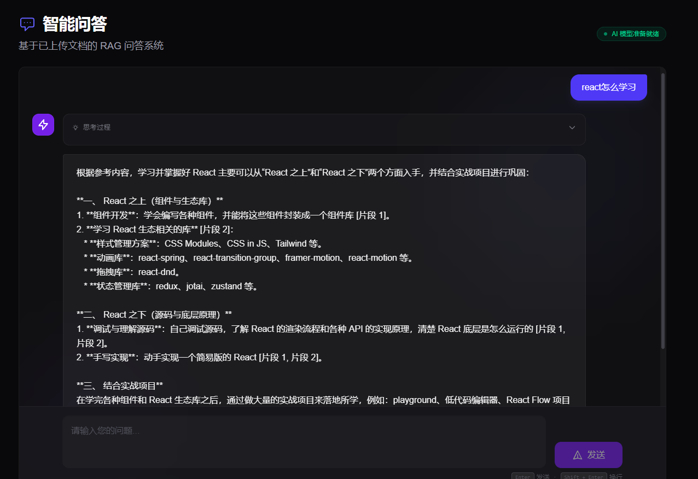
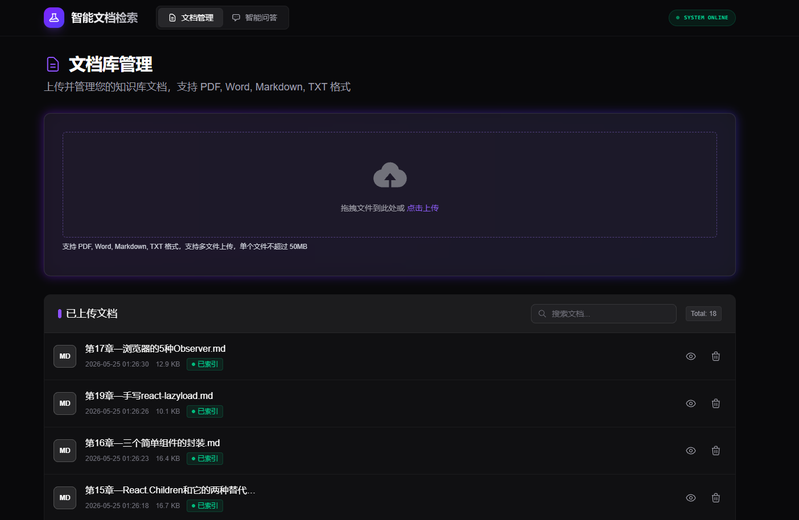

# Document-RAG-System

**本地知识库混合检索问答系统** · FastAPI + LangChain + FAISS + Vue 3

把 PDF / Word / Markdown / TXT 变成可追问的知识库：两阶段混合检索（FAISS 稠密召回 + BM25 稀疏召回 → RRF 融合 → Cross-Encoder 精排），检索不到就明确拒答，回答质量用离线评估量化跟踪。


---

## 这个 RAG 和"调一次 API 的 demo"差在哪

**1. 检索是两阶段混合，不是单路向量。**
中文场景里的专有名词、缩写、短查询，纯向量召回容易漏。这里 FAISS 稠密与 BM25（jieba 分词）稀疏双路并行召回，用 RRF（k=60）做排名融合——只用 rank 不用分数，天然免疫两路分数尺度不可比的问题——再经 cross-encoder 精排，低于 0.2 相关性阈值的片段直接丢弃：**宁可拒答，不喂低相关上下文给模型编故事。**

**2. 效果有数字，不靠"感觉变好了"。**
自建 RAGAS 风格 LLM-as-Judge 离线评估（[rag-backend/eval/](rag-backend/eval/)），并做了 2×2 检索消融实验（混检 / 精排开关全组合）：

| 配置 | Context Precision | Faithfulness | Answer Relevancy |
|---|---|---|---|
| 混检 + 精排（基线） | 0.943 | 0.906 | 0.793 |
| 混检，无精排 | 0.850 (-0.093) | 0.797 (-0.109) | 0.748 (-0.045) |
| 纯向量 + 精排 | 0.948 (+0.005) | 0.927 (+0.021) | 0.840 (+0.047) |
| 纯向量，无精排 | 0.852 (-0.090) | 0.846 (-0.060) | 0.787 (-0.006) |

结论如实写：**精排（+阈值）是质量的最大单一贡献者**——关掉后 Context Precision 0.943→0.850、Faithfulness 0.906→0.797。而在本语料规模（18 文档 / 751 chunks）与 text-embedding-v3 下，混合检索的净收益有限：精排开启时纯向量与混检基本打平（CP 0.948 vs 0.943，差异在小样本噪声量级）。机制上也能解释——full 配置 105 个最终 chunk 里 78 个双路命中、22 个纯向量独供、仅 5 个（4.8%）由 BM25 独供，小语料上稠密召回 Top-20 已近全覆盖。混检的专有名词优势只在无精排管线中显现：no-rerank 时 proper_noun 类 CP 混检 0.940 vs 纯向量 0.905（+0.035）。

> 2026-07 消融实验：35 题 · 裁判模型 qwen-turbo · 生成模型 qwen3.7-plus · 口径：无精排=同时关闭相关性阈值。完整数据见 [rag-backend/eval/results/ablation-20260726-215512/summary.md](rag-backend/eval/results/ablation-20260726-215512/summary.md)。

**3. 过程全透明。**
NDJSON 全链路流式：检索 → 精排 → 生成逐步推送，前端把每一步画出来；每条回答附来源片段、页码与命中路径（vector / bm25 / 双路命中）。

## 架构

```
【索引链路】
  上传 → 解析 (PDF/DOCX/MD/TXT) → Markdown 结构化切片 (500/50) → text-embedding-v3 → FAISS 落盘

【问答链路】
           ┌─► FAISS 稠密召回 (Top 20) ─┐
  提问 ────┤                            ├─► RRF 融合 (k=60) ─► Cross-Encoder 精排
           └─► BM25 稀疏召回 (Top 20) ─┘
       ─► 阈值过滤 (≥0.2) ─► Top-3 上下文 ─► qwen 流式生成 ─► NDJSON ─► 前端逐 token 渲染
```

## 界面预览

**智能问答 —— 流式回答 + 片段引用**



**文档库管理**



## 快速开始

前置：Python 3.12+ · Node.js 18+ · [阿里云 DashScope API Key](https://dashscope.console.aliyun.com/)

```bash
# 1. 后端 (rag-backend/)
cp .env.example .env         # 填入 DASHSCOPE_API_KEY
uv sync
uv run start.py              # http://localhost:8000 ，Swagger 见 /docs

# 2. 前端 (rag-frontend/) —— Vite 已代理 /api → 8000，请先启动后端
npm install
npm run dev                  # http://localhost:5173
```

## 项目结构

```
├── rag-backend/     # FastAPI + LangChain：解析、切片、索引、混合检索、流式问答、离线评估
└── rag-frontend/    # Vue 3 + TS + Pinia：问答界面（过程可视化）、文档管理与在线预览
```

## 深入文档

- **[后端架构与技术决策表](rag-backend/README.md)** —— 每个选型的 "Why this, not that"：RRF vs 加权融合、FlatL2 vs HNSW、阈值取舍、切片策略等
- **[评估方法与指标定义](rag-backend/eval/README.md)** —— LLM-as-Judge 三指标的计算方式与局限

## Roadmap

- [x] 检索消融实验：混检 / 精排 2×2 对照，评测集 10 → 35（见上方结果）
- [ ] 多轮对话与查询改写（指代消解）
- [ ] Docker Compose 一键部署 + 线上 Demo
- [ ] 文档量上万后：FAISS `IndexFlatL2` → `IndexHNSWFlat`，metadata filter 下推到检索层

## License

[MIT](LICENSE)
